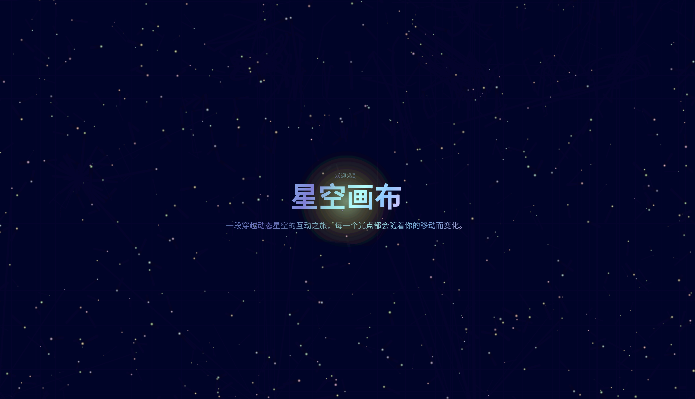

# 星空画布 | Celestial Canvas

<details>
<summary>🇨🇳 中文文档</summary>

## 项目简介

星空画布是一个互动性的网页艺术项目，它创造了一个充满活力的星空环境，让用户能够与星空中的粒子进行互动。每个光点都会对鼠标移动产生反应，创造出梦幻般的视觉效果。

### 特色功能

- 🌟 600个动态星空粒子
- 🎨 流光溢彩的渐变文字效果
- 🖱️ 鼠标互动效果
- 📱 完全响应式设计
- ✨ 平滑的动画效果

### 技术栈

- Vite - 现代前端构建工具
- TypeScript - 类型安全的 JavaScript
- React - 用户界面框架
- Tailwind CSS - 实用优先的 CSS 框架
- shadcn/ui - 精美的 UI 组件库

### 如何运行

1. **安装依赖**
```bash
npm install
```

2. **启动开发服务器**
```bash
npm run dev
```

3. **构建生产版本**
```bash
npm run build
```

### 项目结构

```
src/
├── components/     # 组件目录
│   └── StarryCanvas.tsx    # 星空画布组件
├── pages/          # 页面目录
│   └── Index.tsx   # 主页面
└── index.css       # 全局样式
```

### 使用说明

- 移动鼠标/触摸屏幕来与星星互动
- 观察文字的星空渐变效果
- 享受流畅的动画体验

</details>

<details>
<summary>English Documentation</summary>

## Project Overview

Celestial Canvas is an interactive web art project that creates a dynamic starry environment where users can interact with particles in the night sky. Each point of light responds to mouse movement, creating a dreamy visual experience.

### Features

- 🌟 600 Dynamic Star Particles
- 🎨 Gradient Text Effects
- 🖱️ Mouse Interaction
- 📱 Fully Responsive Design
- ✨ Smooth Animations

### Tech Stack

- Vite - Modern Frontend Build Tool
- TypeScript - Typed JavaScript
- React - UI Framework
- Tailwind CSS - Utility-First CSS Framework
- shadcn/ui - Beautiful UI Components

### Getting Started

1. **Install Dependencies**
```bash
npm install
```

2. **Start Development Server**
```bash
npm run dev
```

3. **Build for Production**
```bash
npm run build
```

### Project Structure

```
src/
├── components/     # Components Directory
│   └── StarryCanvas.tsx    # Starry Canvas Component
├── pages/          # Pages Directory
│   └── Index.tsx   # Main Page
└── index.css       # Global Styles
```

### Usage Guide

- Move your mouse/touch the screen to interact with stars
- Observe the starry gradient text effects
- Enjoy the smooth animations

</details>

---

## 预览 | Preview



## 许可证 | License

MIT License
